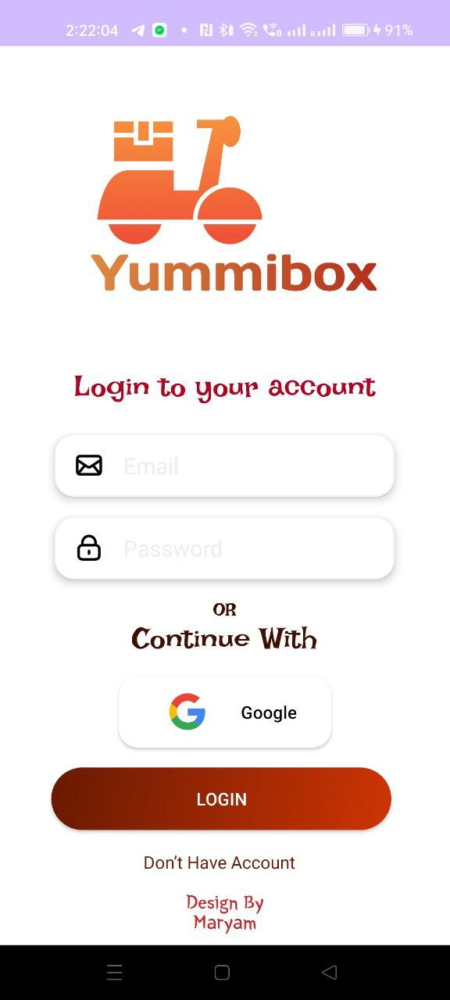
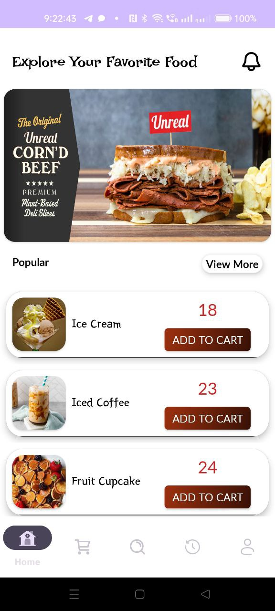
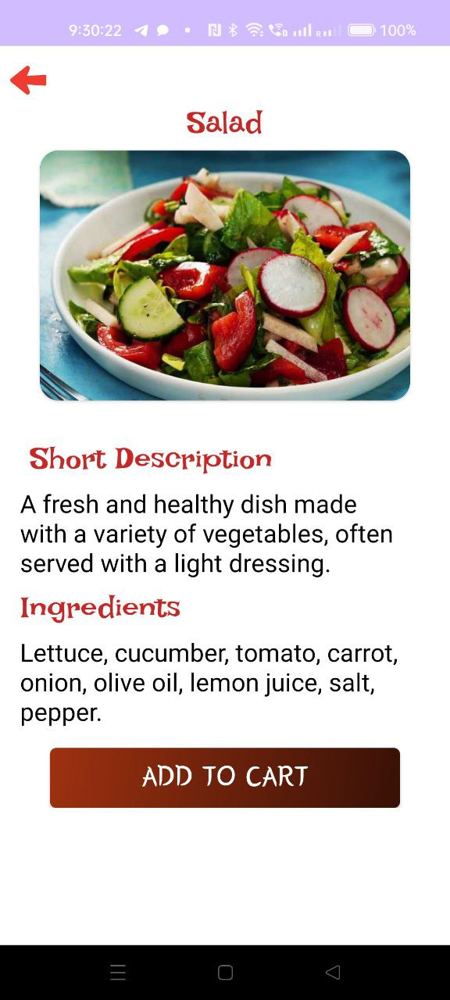
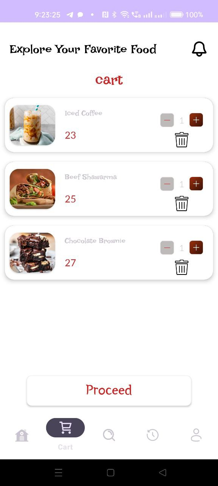
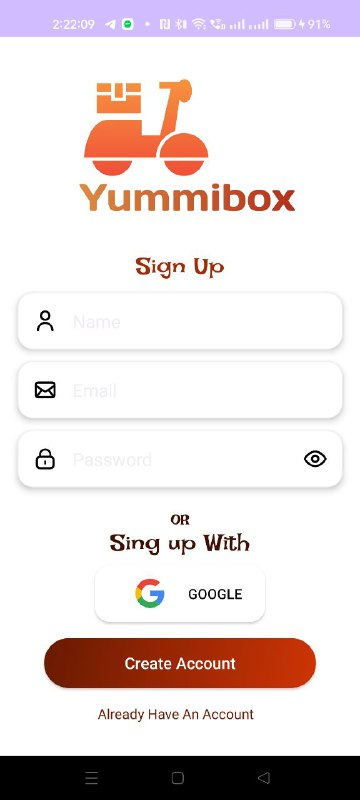
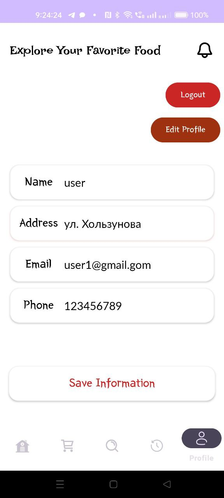
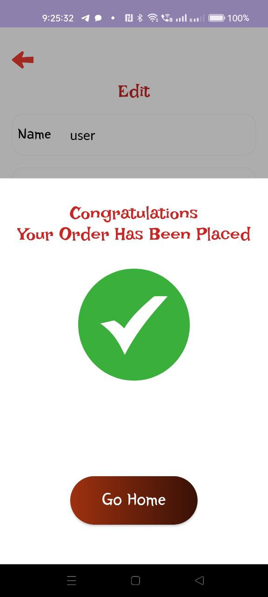
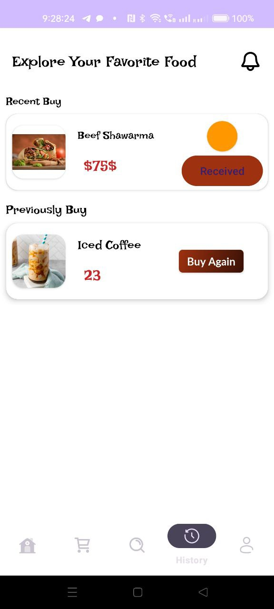

# 🍔 YummiBox - Customer App

<p align="center">
  
</p>

## 📖 Overview

YummiBox is a modern Android food ordering application that allows customers to browse menus, search meals, add items to the cart, place orders, and manage their profiles through an intuitive and user-friendly interface.

This application was built using Kotlin following Android development best practices and integrates with a backend service for authentication and order management.

> 🔗 Admin Dashboard Repository:
> https://github.com/Maryam289/Admin-YummiBox

---

# ✨ Features

- User Registration & Login
- Browse Food Menu
- Search Meals
- View Meal Details
- Add to Cart
- Update Cart Quantity
- Checkout
- Order History
- Notifications
- User Profile
- Location Selection
- Recent Orders
- Buy Again
- Responsive Material UI

---

# 🛠 Tech Stack

- Kotlin
- Android SDK
- Android Studio
- XML Layouts
- RecyclerView
- ViewBinding
- Material Design
- Gradle Kotlin DSL

Backend

- Supabase

Architecture

- MVVM
- Adapter Pattern

---

# 📱 Screenshots

  | **Login**| **Home** | **Details Food** | **Cart** |
  |:------------------------:|:------------------------:|:------------------------:|:------------------------:|
  |  |  |  |  | 
  | **Sing up** | **Profile** | **Successful placed** | **Status of order** |
  |  |  |  |  |

---


# 🚀 Installation


Open with Android Studio

Sync Gradle

Run on Emulator or Android Device

---

# 📂 Folder Structure

```
app/
 ├── adapter
 ├── Fragment
 ├── model
 ├── res
 └── Activities
```

---

---

# 📚 Documentation

Project documentation is available inside the **screenshots** folder.

- 📄 Documentation [(PDF)](https://github.com/Maryam289/YummiBox/blob/master/screenshots/%D0%92%D0%9A%D0%A0.pdf)
- 📊 Project Presentation [(Pptx)](https://github.com/Maryam289/YummiBox/blob/master/screenshots/presentation%20YummiBox.pptx)

---

# 🔮 Future Improvements

- Favorite Meals
- Coupons
- Google Authentication
- Push Notifications

---

# 👩‍💻 Author

Maryam
